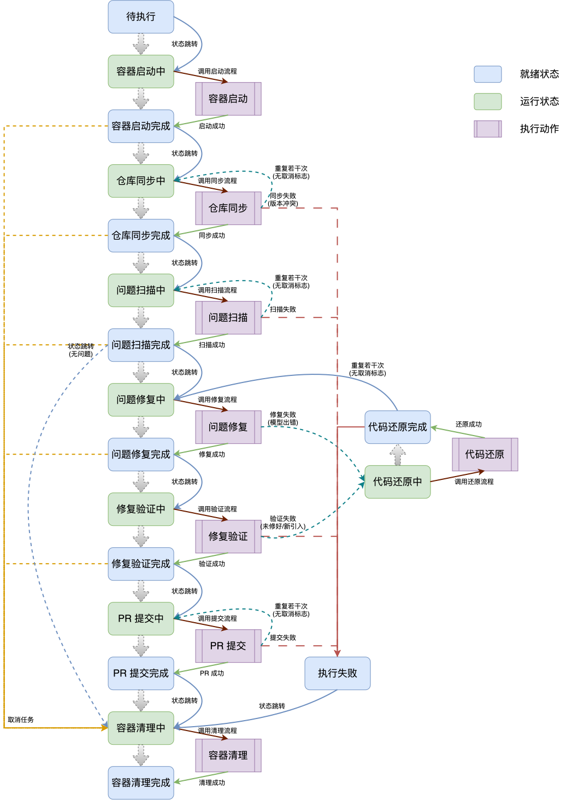
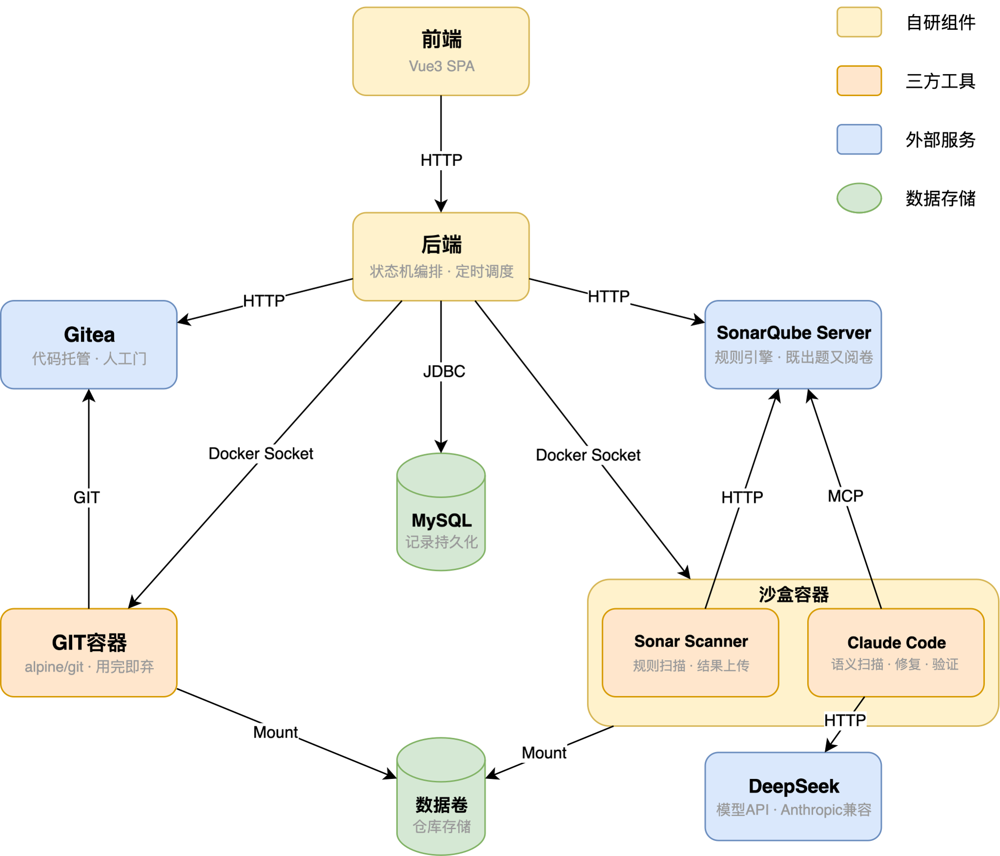

# 详细介绍材料

> 晚上 AI 修代码，早上你顺手审 PR ——「AI 自主 + 人工门」
> 演示环境：[https://morningstar369.com/dev/about](https://morningstar369.com/dev/about)（账号：SpiderMan / xxxxxxxx）

**代码工坊**是一个 **AI 自动值守的代码质量优化流水线**，瞄准“技术债只增不减、人力无暇消化、夜间算力空转”的痛点问题：夜间定时调度，AI 在沙盒中自动完成扫描 → 修复 → 验证 → 提交 PR；早上开发人员只需评审 PR、决定是否合并——重活归 AI，裁决权在人。

平台采用 SonarQube 规则引擎与 Claude 语义理解双通道扫描，修复后经“客观重扫比对 + AI 语义评审”两道防线验证。宁可整轮重修，也不放行可疑修复。全流程由 18 态状态机驱动，具备重试、回退、卡死清理与重启恢复能力，保障夜间无人值守稳定运行。安全上，能改仓库代码的凭证绝不进入 AI 容器，配合最小权限与凭证脱敏，把风险限制在最小范围。

平台利用夜间闲时算力，几乎不新增硬件成本，让 AI 在人划定的边界内，把人从重复劳动中解放出来。

---

## 一、痛点问题与解决思路

### （一）痛点问题：技术债堆积 × 人力不足 × 算力错配

1. **技术债只增不减**：白天为赶进度，开发人员只保核心业务逻辑跑通，留下一堆不影响运行、但存在隐患的技术债。
2. **人力无暇消化**：这些技术债单个不难治理，但同样的工时，花在业务需求上产出明确，花在还债上几乎看不见收益，因此开发人员没有意愿处理。
3. **算力供需错配**：白天行内模型资源被人机协同任务占满；到了夜间算力又大量空转。

### （二）解决思路：晚上 AI 修问题 + 早上人工审 PR

1. **晚上 AI 修问题**：夜间定时调度拉起流水线，扫描、修复、验证、提交 PR 全程无人值守——重活归 AI。
2. **早上人工审 PR**：开发人员上班第一件事就是评审 PR，决定是否合并——裁决权在人。

---

## 二、核心流程：扫描 → 修复 → 验证 → 提交

### （一）双通道扫描：规则引擎 + 语义理解

扫描出的每个问题都按三个质量维度打标（一个 issue 可同时带多个标签）：**Security（安全漏洞）/ Reliability（逻辑缺陷）/ Maintainability（代码异味）**。

- **SonarQube 通道**：规则引擎做已知模式识别——空指针、SQL 注入、资源泄漏等规则化问题；每条 issue 附带规则文档（问题是什么、怎么修），直接成为修复环节的诊断上下文。
- **AI Discovery 通道**：Claude 做语义理解——上帝类、竞态条件、N+1 查询、语义重复等规则引擎抓不到的问题；按约定 schema 输出，包含问题描述、修复建议、类型分类。

两个通道互补而非替代：一个抓"规则写得出来的"，一个抓"要读懂代码才知道的"。发现的问题合并为统一模型落库（来源字段区分 + 多态元数据），走同一套修复与验证流程；PR 报告中逐条标注来源（【来源：SONAR】/【来源：AI】）。

### （二）AI 修复：统一 prompt + MCP 自查

扫描阶段已把每个问题的诊断信息入库，修复时所有 issue 共用一个 prompt 模板——AI 从标题、代码片段、元数据中获取上下文，修完即调用 SonarQube MCP 自查改过的文件，确保不引入新 issue。

修复产出克制。AI 只输出「一句话总结 + 修复思路」作为 commit message，不让它自述验证过程、不自评修复风险——验证是下一环节的职责；让刚改完代码的模型给自己的改动评风险，也没有信息增量。

### （三）两道防线验证：客观门禁 + 语义评审

设置两道验证，两道都过才算通过：

1. **SonarQube 重扫 → 原来报的问题都消了吗？有没有引入新问题？**
    修复完成后重新扫描、逐条比对——本轮修的问题必须全部关闭，且不允许出现回归（多出新问题即整轮失败）。
2. **AI 语义评审 → 修复思路对不对？代码真的按思路改到位了吗？**
    不给 diff，让 AI 直接读修复后的代码，结合扫描阶段的 issue 诊断和修复阶段的 commit message 做判断——思路是 commit message 描述的，对错是读代码验的。

两道缺一不可：只有重扫，防得住"没修干净、引入回归"，防不住"改错方向"；只有评审，防得住方向错，防不住悄悄冒出的新问题。

### （四）提交 PR：结构化诊断报告

验证通过后，推送修复分支并在 Gitea 上创建 PR。PR
描述是统一格式的诊断报告，每条问题包含：标题、三维严重度、代码片段链接（直达源码对应行）、修改记录链接（直达对应 commit）；AI
发现的问题额外附带类型与诊断说明。评审者不需要打开 SonarQube、也不用翻原始扫描数据——PR 本身就是一份可以直接评审的报告。

### （五）串行修复：一轮一 PR

修复过程必须串行：每修一个 issue，代码基线就变一次——基于同一基线并行修出多个 PR，合并时容易互相冲突。因此修复逐 issue commit 叠加在同一分支上，一轮 run 只产出一个 PR；夜间每仓库跑一轮，只形成一个 PR。跨晚继续修时，下一轮先同步最新远端代码：已合并的 PR 进入新基线，未合并的旧 PR 继续等待人工处置。

---

## 三、可靠性设计：重试、回退、隔离与兜底

### （一）18 态状态机：一条主链、两种重试、一个终态

整轮任务由一台 18 态状态机驱动：每两个状态构成一个执行阶段（进行中 → 完成），阶段间自动接力。每个可能出错的环节都有重试上限，失败处理分两类——没动代码的环节（同步、扫描、提交）原地重试；动了代码的环节（修复、验证）先回滚到修复前的现场，再重试。重试耗尽才判定失败。状态、动作、触发、转移（state / action / trigger / transition）四要素职责分明，没有嵌套状态机，没有隐式行为。

### （二）整轮回退：要么全过，要么重来

任一环节失败，就整轮回退到修复前的干净基线，所有 issue 重新修一遍。不允许“修好的保留、只重修失败的”——不同基线上产生的修复拼在一起，彼此没有兼容验证，回归风险高。夜间 AI 算力不稀缺，重修的代价远小于一个带回归的 PR 合进主干。

每轮修复的 issue 数量可以配置，Sonar/AI 两通道分别设上限，它们同时决定了整轮回退的牵连面：上限调低，一次失败拖累的重修范围就小；都设为 1 就等效每轮只修一个问题，失败不牵连其他 issue——行为靠调参覆盖，架构不用动。

### （三）沙盒隔离与故障兜底

- **沙盒隔离**：每轮任务起独立沙盒容器，代码卷按项目缓存复用，项目删除时连卷回收。
- **失败兜底**：任何一步失败都落入统一失败态并记录原因，全局兜底防漏网；清理环节做了防循环设计——清理失败不再触发清理，避免无限循环；容器已不存在即视为清理成功。
- **卡死与超时清理**：任务超过阈值时长没有任何状态流转即判定卡死，绕过状态机强制清理回收资源；次日早上仍未跑完的任务一律取消——夜间的活不过夜，不影响白天研发。
- **重启恢复**：后端重启不丢任务：数据库里定格的执行中任务会被逐个接回状态机——做到一半的按失败进入重试，刚好做完的补发通知继续接力。

---

## 四、整体架构

架构按四类角色组织——自研组件、三方工具、外部服务、数据存储。自研的重心不在执行而在指挥：每个动作的步骤里调用成熟工具（Git、Sonar Scanner、Claude Code），但动作什么时候触发、失败怎么重试回退、凭证怎么注入、结果怎么统计，全由自研后端掌控；前端把每轮任务的状态实时可视化。

---

## 五、安全模型：能改仓库代码的凭证，绝不进 AI 容器

三条防线逐层收紧：让 AI **碰不到**、让凭证**权不大**、让痕迹**留不下**。

1. **凭证隔离——碰不到**：Git 凭证只留后端，每次使用由后端注入临时容器，当次生效、用完即毁。AI 容器内零 Git 凭证，进沙盒的只有模型 API key 和 SonarQube token——两者都是可独立轮换的非代码权限。
2. **最小权限——权不大**：双 token 各司其职。admin token 只在项目接入/改配置时使用，流水线运行全程零 admin 凭证；bot token 写权限随协作者身份按仓库收放——接入时授权、删除时回收，只覆盖已接入仓库。
3. **凭证脱敏——留不下**：命令日志与失败异常中的凭证值统一打码，凭证不进日志、不落库。

除了凭证，身份也做了分离：项目管理员 / 流水线机器人 / 平台管理员各司其职。平台管理员只有熔断权与调度权——可取消任何卡死的任务、启停任何项目的调度；没有配置编辑权、不级联打断现场。任一身份被攻破或滥用，爆炸半径都被限制在自己的职责内。

---

## 六、平台运维 KPI：规模 → 实时 → 产出 → 质量 → 价值

| 指标 | 维度 | 讲的是什么 |
|---|---|---|
| 接入仓库 | 规模 | 平台服务的项目面有多大 |
| 并发任务 | 实时 | 此刻并发槽占用 |
| 累计交付修复 | 产出 | AI 实际修掉并通过验证的 issue 数 |
| PR 合并率 | 质量 | 人工评审通过的 PR 比例 |
| 累计节约人天 | 价值 | 已采纳 issue 估算工时之和 |

---

## 七、开发过程

### （一）开发模式：人主导 + AI 辅助

项目自身由“人 + Trae”协作构建，**分工原则是：不可外包的判断人把住，可快速修正的表达交给 AI**。
后端（状态机、动作边界、安全模型、权限、数据一致性）决定产品能否正确且安全地改代码，出错代价是越权、写坏仓库、状态机死锁——由人牢牢握住，AI 只承担样板代码、单测骨架、调试辅助。
前端迭代快、回滚成本低，页面布局、组件组装、样式让 AI 多承担，人负责信息架构定稿与关键交互拍板。

### （二）后端实现演进：从状态机骨架到真实流水线

1. **跑通基础状态机**：先搭一条最简主链，所有动作用假实现，只验证状态机本身正确——事件怎么发、状态怎么落、数据是否一致，不关心真实修复能力。
2. **加入重试与回退环**：真实修复一定会出现失败，回退环必须在接入真实动作之前定稿。
3. **按依赖顺序填真实动作**：同步的代码是扫描的前置、扫描的问题是修复的前置，每换一个真实实现就跑端到端验证，顺序替换避免多变量同时爆炸。
4. **PR 反馈独立成环**：提交后的人工裁决不污染状态机，由定时任务轮询回写——观测归观测、流程归流程。

---

## 八、项目价值与未来规划

### （一）项目价值

- **自动化闭环，解放人力**：将「扫描 → 修复 → 验证」的繁琐流程转化为后台无感进程。
- **专注业务，治理技术债**：AI 在后台治理技术债，开发人员聚焦核心业务研发。
- **极低成本，极致利用**：充分利用行内既有闲时算力，几乎不新增硬件成本。
- **严控风险，守住合规底线**：绝不赋予 AI 生产发布或主干合并权限，代码安全可控。
- **渐进式演进，远景可期**：架构具备良好扩展性，条件成熟时可接入完整研发流水线。

### （二）未来规划（后置事项，条件成熟再做）

| 事项 | 条件 |
|---|---|
| 高频缺陷分析反哺研发培训 | 长期积累大量 issue 数据后做聚合分析——当前量级无统计意义 |
| 项目优先级排序 | 资源充足，先到先修即可；资源紧张时再配置优先级 |
| GitLab 适配 | 内网部署时可替换代码托管平台的具体实现为 GitLab |
| 管理员操作审计表 | 出现争议时从日志留痕升级 |
| 容器网络出站白名单 | 出现外发风险或合规要求时，限制沙盒只放行依赖服务 |

---

## 九、答辩预设 Q&A

### （一）为什么只做代码质量优化，不做完整研发流水线？

愿景是完整流水线：需求拆解 → UI 生成 → 代码生成 → 自动测试 → 代码质量优化。但在当前 AI 技术节点，无论 OpenHands、Devin 还是 SWE-agent，都还无法真正全自动、闭环地跑通这条链。卡点不止在需求侧，而是贯穿每个环节：

- **需求侧发散**：需求本身是发散的，没有「绝对确定」的输入；
- **缺少诚实裁判**：做得对不对要靠测试判定，而现有项目单测覆盖率普遍撑不起自动化判定；
- **智能体能力不足**：长链路上下文膨胀与迷失，容易「烟囱式」乱写代码；
- **环境难以复制**：沙盒很难还原真实开发环境，跑出来的东西和实际脱节；
- **模型资源约束**：行内模型资源有限，复杂任务 token 消耗大，且需要人机协同的任务只能占白天工时，模型资源更紧张。

代码质量优化是整条链里唯一把每个卡点都绕开的环节：**输入确定**——规则引擎扫出的每个问题都有明确定义和修复依据；**裁判确定**——修复后重扫比对，多一个少一个清清楚楚，SonarQube 既出题又阅卷；**链路短**——单 issue 修复是小上下文任务，正好避开智能体的长链路短板；**环境自包含**——沙盒里只需要代码和扫描工具，不依赖完整开发环境；**资源匹配**——任务确定、消耗可控，正好用夜间闲时算力，不挤占白天人机协同。

所以不是「不想做完整流水线」，而是「这是当前唯一能把 AI 自主跑起来的确定性环节」。同时，人不经手的代码难以真正发现隐患，即便在这个确定性环节，最终合并权也仍在人手里；架构上也为将来向上下游扩展预留了空间。

### （二）AI 修错了、修坏了怎么办？

修复完成后先过两道验证防线（SonarQube 重扫客观门禁 + Claude 语义评审），失败整轮回退重试、耗尽即放弃；即便验证全过，最后还有人工合并门——AI 没有主干写权限，合并权永远在人手里。

### （三）仓库凭证会不会被 AI 偷走？

不会。Git 凭证只留后端，用时注入临时容器、当次生效用完即毁，AI 容器内零 Git 凭证——prompt injection 偷不到仓库写权限；bot token 按仓库收放、admin token 运行全程不出现；日志与异常中的凭证值统一打码，不进日志、不落库。

### （四）静态分析为什么选 SonarQube，而不是 PMD/SpotBugs？

静态分析的核心不是“谁扫描得准”，而是“谁能让修复和验证环节有料可依”。SonarQube 独家提供三样东西：完整规则文档（问题是什么、怎么修，直接喂给修复 prompt）、server 端状态（支持重扫后数量对比，喂给验证环节）、MCP 接口（供修复后自查是否引入新问题）——只有它把"扫描→修复→验证"串成了可喂给 AI 的闭环。PMD/SpotBugs 只有告警，无 server 无 MCP，即便告警更精确也用不上。

### （五）为什么需要 AI 扫描，只是静态扫描不行吗？

Sonar 规则引擎能稳定识别的，是**规则化问题**，落到真实修复场景典型三类：

1. **逻辑缺陷**：资源泄漏、空指针风险、除零。
2. **安全漏洞**：硬编码凭证、使用过时的加密套件 MD5、未使用 PreparedStatement 拼接 SQL。
3. **代码异味**：废弃 API、方法复杂度过高、重复代码块。

但 Sonar 只能抓"规则化"的模式，语义层面的问题——竞态条件、死锁风险、N+1 查询、上帝类、语义重复、敏感数据泄露——它抓不到，这正是需要 **AI Discovery（Claude）** 作第二通道补齐的原因。
